# 🎂 QueueAI - Simple Setup Guide

<div align="center">

**A smart queue analytics system using YOLO11 AI for patisseries and bakeries.**

[](https://www.python.org/)
[](https://fastapi.tiangolo.com/)
[](https://reactjs.org/)
[](https://github.com/ultralytics/ultralytics)

</div>

---

## 📑 Table of Contents

### 🚀 Getting Started
- [What This Does](#-what-this-does)
- [Technology Stack](#️-technology-stack)
- [Project Structure](#-project-structure)
- [Quick Start (5 minutes)](#-quick-start-5-minutes)
  - [Setup Backend (Python)](#1-setup-backend-python)
  - [Setup Frontend (React)](#2-setup-frontend-react)

### 💻 Technical Documentation
- [Python Code Explanation](#-python-code-explanation)
  - [Core AI Detection Function](#core-ai-detection-function)
  - [FastAPI Server Structure](#fastapi-server-structure)
  - [Timer System (FPS-based)](#timer-system-fps-based)
- [How It Works](#-how-it-works)
  - [Video Upload](#1-video-upload)
  - [Zone Definition](#2-zone-definition)
  - [AI Analysis](#3-ai-analysis)
  - [Real-time Dashboard](#4-real-time-dashboard)

### 🎯 Features & Implementation
- [Key Features Explained](#-key-features-explained)
  - [Multi-Zone Polygon Detection](#multi-zone-polygon-detection)
  - [Person Tracking Across Frames](#person-tracking-across-frames)
  - [Wait Time Calculation](#wait-time-calculation)
- [Alert System Logic](#-alert-system-logic)
- [Business Metrics Calculation](#-business-metrics-calculation)

### ⚙️ Configuration & Usage
- [Configuration Options](#-configuration-options)
  - [YOLO Model Settings](#yolo-model-settings)
  - [Analysis Parameters](#analysis-parameters)
- [Example Usage](#-example-usage)

### 🔧 Troubleshooting & Support
- [Common Issues & Solutions](#-common-issues--solutions)
  - [Backend Issues](#backend-issues)
  - [Frontend Issues](#frontend-issues)
  - [Analysis Issues](#analysis-issues)

### 📚 Additional Resources
- [Next Steps](#-next-steps)
- [License](#-license)

---

## 🚀 What This Does

- **Detects people** in video using AI
- **Tracks queue wait times** automatically  
- **Shows real-time analytics** in a web dashboard
- **Alerts when queues get too long**

[↑ Back to Table of Contents](#-table-of-contents)

---

## 🛠️ Technology Stack

```mermaid
graph LR
    A[📹 Video Input] --> B[🐍 Python Backend]
    B --> C[🤖 YOLO11 AI]
    C --> D[📊 FastAPI]
    D --> E[⚛️ React Frontend]
    E --> F[📱 Web Dashboard]
    
    style A fill:#ff6b6b
    style C fill:#4ecdc4
    style D fill:#45b7d1
    style E fill:#96ceb4
    style F fill:#feca57
```



- **Backend**: Python + FastAPI + YOLO11
- **Frontend**: React + TypeScript + Next.js
- **AI Model**: Ultralytics YOLO11 for person detection

[↑ Back to Table of Contents](#-table-of-contents)

---

## 📁 Project Structure

```mermaid
graph TD
    A[🏠 JawekA7laJaw/] --> B[🐍 backend/]
    A --> C[⚛️ frontend/]
    A --> D[📄 README.md]
    
    B --> B1[🚀 app.py - Main FastAPI server]
    B --> B2[📋 requirements.txt - Python deps]
    B --> B3[🤖 yolo11n.pt - AI model]
    
    C --> C1[📱 app/ - Next.js pages]
    C --> C2[🎨 components/ - UI components]
    C --> C3[📦 package.json - Node deps]
    
    style A fill:#feca57
    style B fill:#4ecdc4
    style C fill:#96ceb4
    style B1 fill:#ff6b6b
    style C1 fill:#fd79a8
```



```
JawekA7laJaw/
├── backend/               # Python API server
│   ├── app.py            # Main FastAPI application
│   ├── requirements.txt  # Python dependencies
│   └── yolo11n.pt       # AI model (auto-downloaded)
├── frontend/             # React web dashboard
│   ├── app/             # Next.js pages
│   ├── components/      # UI components
│   └── package.json     # Node dependencies
└── README.md            # This file
```

[↑ Back to Table of Contents](#-table-of-contents)

---

## ⚡ Quick Start (5 minutes)

### 1. Setup Backend (Python)

```bash
# Navigate to backend folder
cd backend

# Create virtual environment
python -m venv venv

# Activate environment (Windows)
.\venv\Scripts\Activate.ps1
# Or for Linux/Mac: source venv/bin/activate

# Install Python packages
pip install -r requirements.txt

# Start the API server
python app.py
```

**✅ Backend runs at:** http://localhost:8000

### 2. Setup Frontend (React)

```bash
# Navigate to frontend folder (new terminal)
cd frontend

# Install JavaScript packages
npm install
# Or use: pnpm install

# Start development server
npm run dev
# Or use: pnpm dev
```

**✅ Frontend runs at:** http://localhost:3000

[↑ Back to Table of Contents](#-table-of-contents)

---

## 🐍 Python Code Explanation

### Core AI Detection Function

```python
def run_multi_zone_analysis(video_path, zones, fps, conf=0.4):
    """
    Analyzes queue activity in multiple zones using YOLO11
    
    Args:
        video_path: Path to video file
        zones: List of polygon coordinates for queue areas
        fps: Video frames per second
        conf: AI confidence threshold (0.4 = 40% sure)
    
    Returns:
        Analytics data with wait times and queue metrics
    """
    
    # 1. Load YOLO11 AI model
    model = YOLO("yolo11n.pt")  # 'n' = nano (fastest)
    
    # 2. Convert zones to OpenCV polygon format
    polygons = [np.array(zone, dtype=np.int32) for zone in zones]
    
    # 3. Process video frame by frame
    for frame_result in model.track(video_path, persist=True):
        
        # 4. Get person detections from current frame
        if frame_result.boxes and frame_result.boxes.id:
            ids = frame_result.boxes.id.cpu().numpy()
            boxes = frame_result.boxes.xyxy.cpu().numpy()
            
            # 5. For each detected person
            for person_id, bbox in zip(ids, boxes):
                # Calculate center point of person
                x1, y1, x2, y2 = bbox
                center_x = (x1 + x2) / 2
                center_y = (y1 + y2) / 2
                
                # Check which zone this person is in
                for i, polygon in enumerate(polygons):
                    if cv2.pointPolygonTest(polygon, (center_x, center_y), False) >= 0:
                        # Person is in this zone - update their timer
                        update_wait_time(person_id, zone_id=i)
    
    return calculate_analytics()
```

### FastAPI Server Structure

```python
from fastapi import FastAPI, UploadFile, File
from ultralytics import YOLO
import cv2
import numpy as np

# Create FastAPI app
app = FastAPI()

# Load AI model once at startup
model = YOLO("yolo11n.pt")

@app.post("/upload-video")
async def upload_video(file: UploadFile = File(...)):
    """Upload video and extract first frame"""
    # Save uploaded file
    video_path = save_video(file)
    
    # Extract video information
    cap = cv2.VideoCapture(video_path)
    fps = cap.get(cv2.CAP_PROP_FPS)
    frame_count = int(cap.get(cv2.CAP_PROP_FRAME_COUNT))
    
    # Get first frame for zone drawing
    ret, frame = cap.read()
    first_frame_base64 = encode_frame_to_base64(frame)
    
    return {
        "video_id": generate_id(),
        "fps": fps,
        "frame_count": frame_count,
        "first_frame": first_frame_base64
    }

@app.post("/analyze-multi-zone") 
async def analyze_zones(request: AnalyzeRequest):
    """Run AI analysis on defined zones"""
    
    # Get video file path
    video_path = get_video_path(request.video_id)
    
    # Run YOLO analysis
    results = run_multi_zone_analysis(
        video_path=video_path,
        zones=request.zones,
        fps=get_video_fps(video_path),
        conf=request.confidence
    )
    
    return results
```

### Timer System (FPS-based)

```python
class FPSBasedTimer:
    """Calculates wait times using video frame rate"""
    
    def __init__(self, fps=30):
        self.fps = fps
        self.frame_count = 0
        self.person_start_frames = {}  # person_id -> frame when they entered
    
    def update_frame(self, detected_people):
        """Call this for each video frame"""
        self.frame_count += 1
        
        # For each person detected in current frame
        for person_id in detected_people:
            if person_id not in self.person_start_frames:
                # First time seeing this person
                self.person_start_frames[person_id] = self.frame_count
    
    def get_wait_time(self, person_id):
        """Get how long person has been waiting (in seconds)"""
        if person_id in self.person_start_frames:
            frames_waited = self.frame_count - self.person_start_frames[person_id]
            seconds_waited = frames_waited / self.fps
            return seconds_waited
        return 0
```

[↑ Back to Table of Contents](#-table-of-contents)

---

## 📊 How It Works

```mermaid
flowchart TD
    A[📹 Upload Video] --> B[🎯 Draw Queue Zones]
    B --> C[🤖 YOLO11 AI Detection]
    C --> D[👥 Track People]
    D --> E[⏱️ Calculate Wait Times]
    E --> F[📊 Generate Analytics]
    F --> G[🚨 Create Alerts]
    G --> H[📱 Display Dashboard]
    
    style A fill:#ff6b6b
    style C fill:#4ecdc4
    style E fill:#feca57
    style F fill:#96ceb4
    style H fill:#fd79a8
```



### 1. Video Upload
```python
# User uploads video file
video_file = request.files['video']

# System extracts metadata
fps = get_video_fps(video_file)           # 30 frames per second
duration = get_video_duration(video_file) # 120 seconds
first_frame = extract_first_frame(video_file)  # For zone drawing
```

### 2. Zone Definition

```mermaid
graph LR
    A[🖼️ Video Frame] --> B[✏️ Draw Polygons]
    B --> C[📍 Zone 1: Main Queue]
    B --> D[📍 Zone 2: Express Lane]
    B --> E[📍 Zone 3: Pickup]
    
    style A fill:#ff6b6b
    style B fill:#feca57
    style C fill:#4ecdc4
    style D fill:#96ceb4
    style E fill:#fd79a8
```



```python
# User draws polygons on video frame
zones = [
    {
        "name": "Main Queue", 
        "polygon": [[100,200], [300,200], [300,400], [100,400]]  # Rectangle
    },
    {
        "name": "Express Lane",
        "polygon": [[350,150], [500,150], [500,300], [350,300]]  # Another rectangle
    }
]
```

### 3. AI Analysis

```mermaid
sequenceDiagram
    participant V as 📹 Video Frame
    participant Y as 🤖 YOLO11
    participant T as ⏱️ Timer
    participant A as 📊 Analytics
    
    V->>Y: Send frame
    Y->>Y: Detect people
    Y->>T: Update person locations
    T->>T: Calculate wait times
    T->>A: Send metrics
    A->>A: Generate insights
```



```python
# For each video frame:
people = yolo_model.detect_people(frame)     # Find all people
for person in people:
    zone = find_person_zone(person.center, zones)  # Which zone are they in?
    if zone:
        timer.update_person_wait_time(person.id, zone.id)  # Track their wait time

# After processing all frames:
analytics = {
    "avg_wait_time": calculate_average(all_wait_times),
    "max_queue_length": max(queue_lengths_per_frame),
    "people_served": count_unique_people(),
    "peak_hour": find_busiest_time()
}
```

### 4. Real-time Dashboard

```mermaid
pie title Queue Analytics Dashboard
    "✅ Served Customers" : 73
    "⏳ Currently Waiting" : 12
    "❌ Abandoned Queue" : 2
```



```python
# Calculate business metrics
efficiency = (people_served / total_people) * 100
revenue_impact = saved_customers * average_purchase_value
staff_recommendation = "Add 1 cashier" if avg_wait > 3 else "Current staffing OK"

# Send to frontend
return {
    "queue_length": current_queue_length,
    "wait_time": current_avg_wait,
    "efficiency": efficiency,
    "alerts": generate_alerts(),
    "recommendations": generate_recommendations()
}
```

[↑ Back to Table of Contents](#-table-of-contents)

---

## 🎯 Key Features Explained

### Multi-Zone Polygon Detection

```mermaid
graph TB
    A[🎥 Video Frame] --> B{👤 Person Detected}
    B --> C[📍 Calculate Center Point]
    C --> D{🔍 Check Each Zone}
    D -->|Zone 1| E[📊 Main Queue]
    D -->|Zone 2| F[⚡ Express Lane]
    D -->|Zone 3| G[📦 Pickup Area]
    E --> H[⏱️ Start Timer]
    F --> H
    G --> H
    H --> I[📈 Update Analytics]
    
    style A fill:#ff6b6b
    style B fill:#feca57
    style E fill:#4ecdc4
    style F fill:#96ceb4
    style G fill:#fd79a8
```



Instead of simple rectangles, we use **polygons** to define queue areas:

```python
# Traditional approach (limited)
queue_area = Rectangle(x1=100, y1=200, x2=300, y2=400)

# Our approach (flexible)
queue_area = Polygon([
    [100, 200],  # Top-left
    [300, 190],  # Top-right (angled)
    [320, 400],  # Bottom-right
    [80, 410]    # Bottom-left (curved queue)
])

# Check if person is inside polygon
is_in_queue = cv2.pointPolygonTest(polygon, person_center, False) >= 0
```

### Person Tracking Across Frames


```python
# YOLO11 with tracking enabled
results = model.track(video_path, persist=True)

for frame_result in results:
    if frame_result.boxes.id is not None:
        # Each person keeps same ID across frames
        person_ids = frame_result.boxes.id.cpu().numpy()
        
        # Track same person through video
        for person_id in person_ids:
            if person_id == 5:  # Same person through multiple frames
                continue_tracking_person_5()
```

### Wait Time Calculation

```mermaid
graph LR
    A[👤 Person Enters<br/>Frame 150] --> B[⏱️ Timer Starts]
    B --> C[📹 Track Through<br/>750 Frames]
    C --> D[👤 Person Exits<br/>Frame 900]
    D --> E[🧮 Calculate<br/>750 ÷ 30 FPS]
    E --> F[⏰ Wait Time<br/>25 Seconds]
    
    style A fill:#ff6b6b
    style B fill:#feca57
    style C fill:#4ecdc4
    style D fill:#96ceb4
    style F fill:#fd79a8
```



```python
# Example: 30 FPS video
fps = 30
person_enters_frame = 150    # Person first seen at frame 150
person_leaves_frame = 900    # Person last seen at frame 900

frames_in_queue = 900 - 150  # 750 frames
wait_time_seconds = 750 / 30 # 25 seconds

# Real-time tracking
wait_times = []
for person_id, entry_frame in person_trackers.items():
    current_wait = (current_frame - entry_frame) / fps
    wait_times.append(current_wait)

average_wait = sum(wait_times) / len(wait_times)
```

[↑ Back to Table of Contents](#-table-of-contents)

---

## 🚨 Alert System Logic

```mermaid
flowchart TD
    A[📊 Queue Metrics] --> B{⏱️ Avg Wait > 3 min?}
    B -->|Yes| C[🔴 CRITICAL]
    B -->|No| D{👥 Queue Length > 6?}
    D -->|Yes| E[🟡 WARNING]
    D -->|No| F[🟢 NORMAL]
    
    C --> G[📢 Add Staff Now!]
    E --> H[👀 Monitor Closely]
    F --> I[✅ All Good]
    
    style C fill:#ff4757,color:#fff
    style E fill:#ffa502,color:#fff
    style F fill:#2ed573,color:#fff
    style G fill:#ff4757,color:#fff
    style H fill:#ffa502,color:#fff
    style I fill:#2ed573,color:#fff
```



```python
def generate_alerts(queue_metrics):
    alerts = []
    
    # Critical: Wait time > 3 minutes
    if queue_metrics.avg_wait_time > 180:  # 180 seconds = 3 minutes
        alerts.append({
            "level": "CRITICAL",
            "message": "Queue wait time exceeded 3 minutes",
            "action": "Add staff immediately",
            "color": "red"
        })
    
    # Warning: Queue length > 6 people
    elif queue_metrics.current_queue_length > 6:
        alerts.append({
            "level": "WARNING", 
            "message": "Queue length is growing",
            "action": "Monitor closely, consider adding staff",
            "color": "yellow"
        })
    
    # Info: Normal operations
    else:
        alerts.append({
            "level": "INFO",
            "message": "Queue operating normally", 
            "action": "Continue monitoring",
            "color": "green"
        })
    
    return alerts
```

[↑ Back to Table of Contents](#-table-of-contents)

---

## 📈 Business Metrics Calculation

```mermaid
graph LR
    A[👥 Customer Data] --> B[💰 Revenue Calculator]
    B --> C[📊 Served: $1,095]
    B --> D[❌ Lost: $50]
    B --> E[⚡ Efficiency: 87%]
    
    F[⏱️ Wait Times] --> G[🤖 AI Recommender]
    G --> H[➕ Add 1 Staff]
    G --> I[📈 +25% Revenue]
    
    style A fill:#4ecdc4
    style B fill:#feca57
    style C fill:#2ed573
    style D fill:#ff4757
    style G fill:#45b7d1
    style I fill:#2ed573
```



```python
def calculate_business_impact(analytics_data):
    # Constants
    AVERAGE_TICKET = 15.00        # Average customer purchase
    ABANDONMENT_COST = 25.00      # Lost opportunity per abandoned customer
    HOURLY_STAFF_COST = 18.00     # Cost per staff member per hour
    
    # Calculations
    customers_served = analytics_data.people_measured
    estimated_abandoned = analytics_data.people_tracked - customers_served
    
    # Revenue calculations
    revenue_from_served = customers_served * AVERAGE_TICKET
    revenue_lost = estimated_abandoned * ABANDONMENT_COST
    
    # Efficiency metrics
    service_efficiency = (customers_served / analytics_data.people_tracked) * 100
    avg_service_time = analytics_data.avg_wait_time / 60  # Convert to minutes
    
    # Recommendations
    if avg_service_time > 3:
        recommendation = f"Add 1 staff member (cost: ${HOURLY_STAFF_COST}/hour)"
        potential_improvement = "Reduce wait time by 40%, increase revenue by 25%"
    else:
        recommendation = "Current staffing is adequate"
        potential_improvement = "Maintain current performance"
    
    return {
        "revenue_generated": revenue_from_served,
        "revenue_lost": revenue_lost,
        "efficiency_percentage": service_efficiency,
        "recommendation": recommendation,
        "potential_improvement": potential_improvement
    }
```

[↑ Back to Table of Contents](#-table-of-contents)

---

## 🔧 Configuration Options

### YOLO Model Settings
```python
# In app.py, modify these settings:

MODEL_SIZE = "yolo11n.pt"    # Options: n(fast), s(balanced), m(accurate), l(slow)
CONFIDENCE = 0.4             # Lower = more detections, Higher = fewer false positives
DEVICE = "0"                 # "0" for GPU, "cpu" for CPU only
CLASSES = [0]                # Only detect people (class 0 in COCO dataset)
```

### Analysis Parameters
```python
# Fine-tune analysis behavior:

MIN_WAIT_TIME = 1.0          # Ignore people who wait < 1 second (passing by)
SAMPLE_STRIDE = 40           # Save annotated frame every 40 frames (for speed)
ZONE_OVERLAP = True          # Allow person to be in multiple zones
TRACKING_PERSISTENCE = True   # Keep tracking people across frame gaps
```

[↑ Back to Table of Contents](#-table-of-contents)

---

## 🎬 Example Usage


### 1. Start the servers
```bash
# Terminal 1: Start backend
cd backend
python app.py

# Terminal 2: Start frontend  
cd frontend
npm run dev
```

### 2. Use the application
1. Open http://localhost:3000
2. Click "Analysis" tab
3. Upload a video of your queue area
4. Draw polygons around queue zones
5. Click "Start Analysis"
6. View results in dashboard

### 3. Expected output
```json
{
  "zones": [
    {
      "zone_name": "Main Queue",
      "metrics": {
        "avg_wait": 45.2,        // 45.2 seconds average wait
        "min_wait": 12.5,        // Shortest wait was 12.5 seconds
        "max_wait": 120.8,       // Longest wait was 2 minutes
        "avg_queue_len": 3.5,    // Average 3.5 people in queue
        "num_people_measured": 42 // Tracked 42 people total
      }
    }
  ],
  "business_recommendations": [
    "Peak hour detected at 12:00-14:00",
    "Consider express lane for orders <$10", 
    "Current efficiency: 87% (Good)"
  ]
}
```

[↑ Back to Table of Contents](#-table-of-contents)

---

## 🐛 Common Issues & Solutions

### Backend Issues

**Problem**: `ModuleNotFoundError: No module named 'ultralytics'`
```bash
# Solution: Install requirements
pip install -r requirements.txt
```

**Problem**: `YOLO model download fails`
```bash
# Solution: Download manually
pip install ultralytics
python -c "from ultralytics import YOLO; YOLO('yolo11n.pt')"
```

**Problem**: `Port 8000 already in use`
```bash
# Solution: Kill existing process
# Windows:
netstat -ano | findstr :8000
taskkill /PID <PID> /F

# Linux/Mac:
lsof -ti:8000 | xargs kill
```

### Frontend Issues

**Problem**: `Cannot connect to backend`
- Make sure backend is running on port 8000
- Check firewall settings
- Verify API_BASE URL in frontend code

**Problem**: `Video upload fails`
- Check video format (MP4, AVI, MOV supported)
- Ensure file size < 100MB
- Check available disk space

### Analysis Issues

**Problem**: `No people detected`
- Lower confidence threshold: `conf=0.3`
- Check video quality and lighting
- Ensure people are clearly visible

**Problem**: `Inaccurate wait times`
- Adjust `min_wait_sec_filter`
- Redraw zone polygons more precisely
- Check video frame rate settings

[↑ Back to Table of Contents](#-table-of-contents)

---

## 🎯 Next Steps

1. **Test with your own videos**
2. **Experiment with different zone shapes**  
3. **Try different YOLO model sizes** (n/s/m/l)
4. **Integrate with your POS system**
5. **Deploy to cloud for production use**

[↑ Back to Table of Contents](#-table-of-contents)

---

## 📝 License

MIT License - Feel free to use and modify!

---

<div align="center">

**Built with ❤️ by Team Jawek A7la Jaw**

*Simple. Smart. Effective.* 🎂✨

[↑ Back to Top](#-queueai---simple-setup-guide)

</div>
